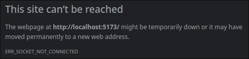

## Описание

1. Заведи в БД таблицу данных о студентах, которая будет содержать: имя, фамилия, отчество, дата рождения, группа, уникальный номер.
2. Создай веб-приложение (клиентскую и серверную части), с помощью которого можно добавить студента, удалить студента по уникальному номеру, вывести список студентов.

## Использование

Запуск производится через командную строку с помощью Docker

Команда для запуска: `docker compose up -d`

После запуска перейти по адресу http://localhost:5173/

### Проблемы

При переходе по адресу http://localhost:5173/ после запуска контейнера появляется следующая ошибка:

Решения я не нашел и может быть проблема связана с моим браузером.
Поэтому предоставляю альтернативный запуск, как обход данной проблемы на первое время.

Для этого необходимо ввести следующую команду: 
`docker compose up -d && cd frontend && npm run dev`

После выполнения данной команды, если файл docker-compose не был изменен, а именно не был убран сервис backend, 
клиентская часть будет доступна по адресу http://localhost:5174/, иначе же по адресу http://localhost:5173/